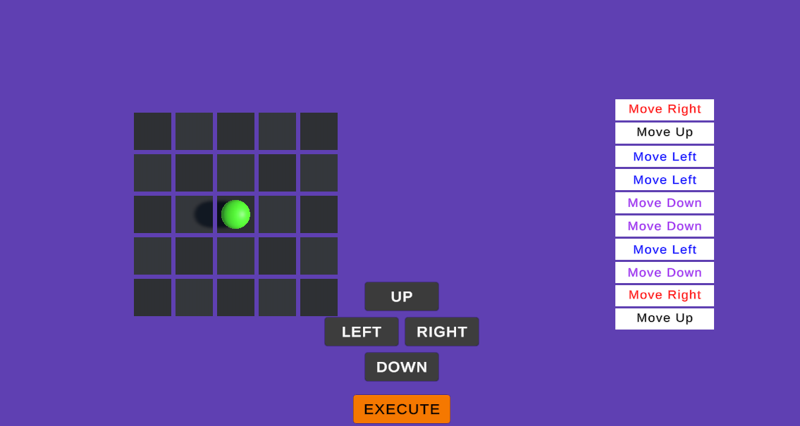

# 🎮 Design Patterns - Command

## 🧠 About the Project

Simple examples to learn **Command Pattern** in Unity. Both use cases focus on decoupling player input from action execution, allowing for features like undo and pre-programmed action sequences.

---

## 🧪 Use Cases

### 🧩 Use Case 1 - Turn Based Movement

In this example, the player can move on a grid using the **W, A, S, D** keys. Each movement is stored as a command.

Pressing **U** will undo the last movement command, returning the player to their previous position. This mechanic is ideal for turn-based games or puzzles where undoing actions is important.

### 🧩 Use Case 2 - Stored Actions

In this scenario, the player clicks on directional buttons (up, down, left, right) to build a **sequence of commands**.

Once the desired sequence is set, clicking the **Execute** button will make the character perform all actions in the order they were stored. This simulates turn-based strategy or programming-style gameplay.

