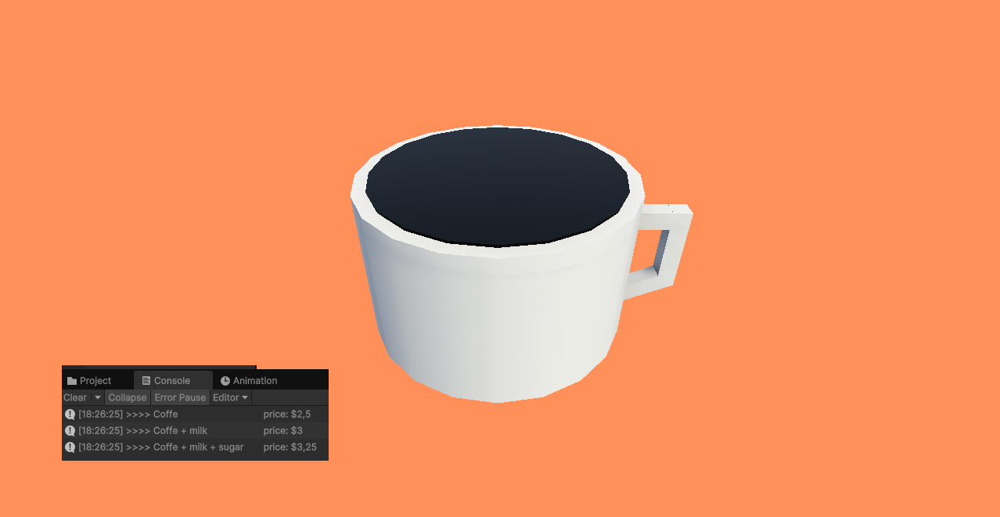
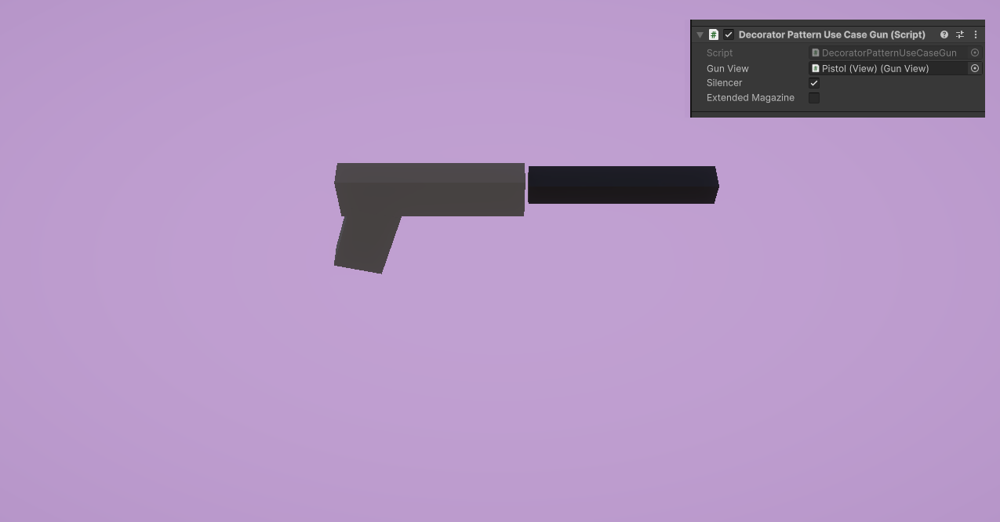
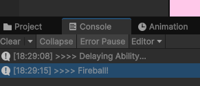

# 🎁 Design Patterns - Decorator

## 🧠 About the Project

Simple examples to learn **Decorator Pattern** in Unity.

---

## 🧪 Use Cases

### 🧩 Use Case 1 - Coffee

In this example we model milk and sugar as decorators and check how the price is affected by each decorator in the console.

### 🧩 Use Case 2 - Gun

In this use case we have a gun and we can add an extended magazine and a silencer using the decorator pattern.

### 🧩 Use Case 3 - Ability

In this use case we use the ability that we created in the **Strategy Pattern** example and decorate it with a new modifier, the DelayedAbility that will enable us to wait a time in  seconds before casting our fireball spell.

