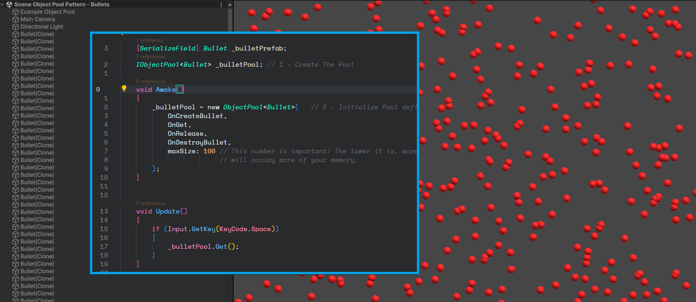

# 🌊 Design Patterns - Object Pool

## 🧠 About the Project

Simple examples to learn **Object Pooling Pattern** in Unity.

---

## 🧪 Use Cases

### 🧩 Use Case 1 - Generic Pool

In this example we create an Object Pool to spawn a huge amount of 3D Spheres in the scene.
Hold Space to spawn the objects.

