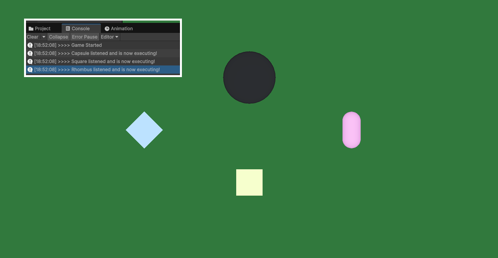
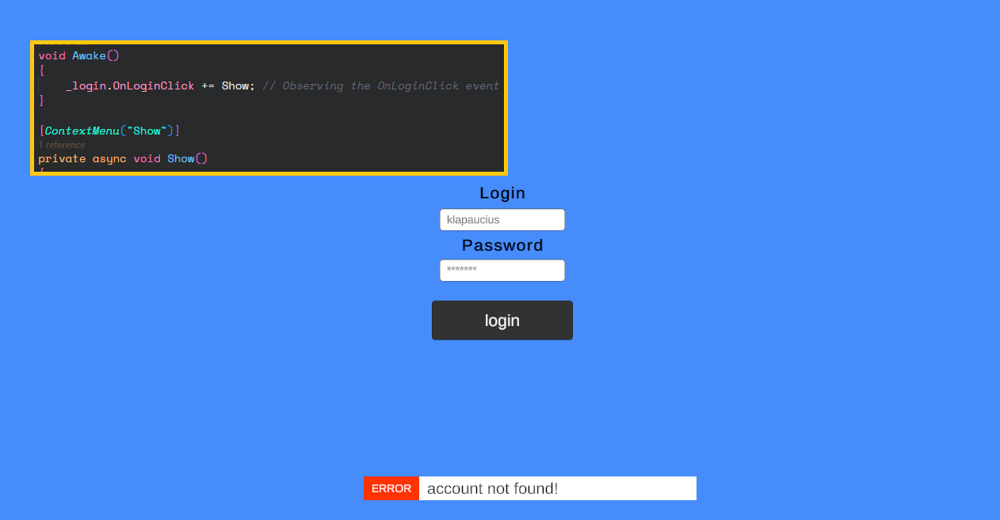
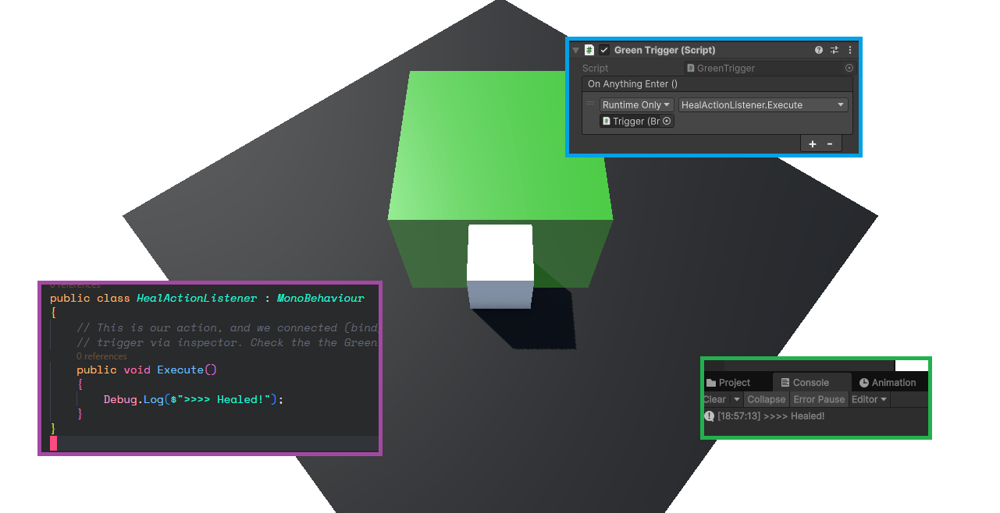

# 👁️‍🗨️ Design Patterns - Observer

## 🧠 About the Project

Simple examples to learn **Observer Pattern** in Unity.

---

## 🧪 Use Cases

### 🧩 Use Case 1 - Generic Case

In this example we implement the Observer Pattern from scratch.

A Sphere will subscribe the listeners and broadcast the event.

### 🧩 Use Case 2 - Toast (event Action)

In this use case we will use the onclick event from Unity and we will create our own custom event to trigger when the login is clicked.

### 🧩 Use Case 3 - Collistion Trigger (unity event)

In this example we will use the UnityEvent class to combine Observer Pattern with the Unity Inspector.

