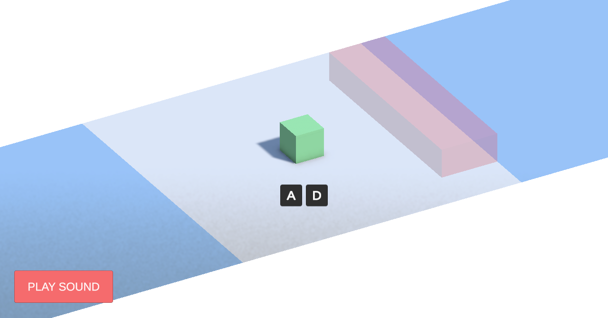
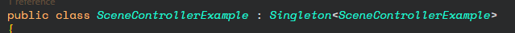

# 👁️‍🗨️ Design Patterns - Singleton

## 🧠 About the Project

Simple examples to learn **Singleton Pattern** in Unity.

---

## 🧪 Use Cases

### 🧩 Use Case 1 - Audio Player

Simple Singleton Pattern used for an Audio Player.

### 🧩 Use Case 2 - Screen Controller

Here we are going to use an utils class to help us implement the Singleton Pattern.

