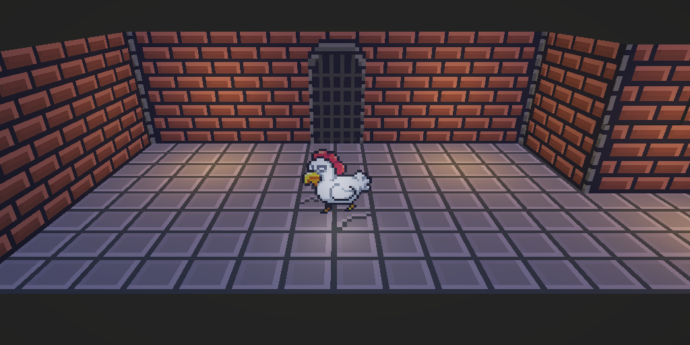

# 🎨 Gameplay - 2.5D

---

---

## 🎮 About the Project

This is a simple 2.5D with Lights applied to sprites.

---

## 📍 Concept

The player uses **A/W/A/S/D** to move.

---

> Built for learning, prototyping, and fun!

> Big thanks to **Tarodev(youtube)** for the sprite receiving shadows shader.
