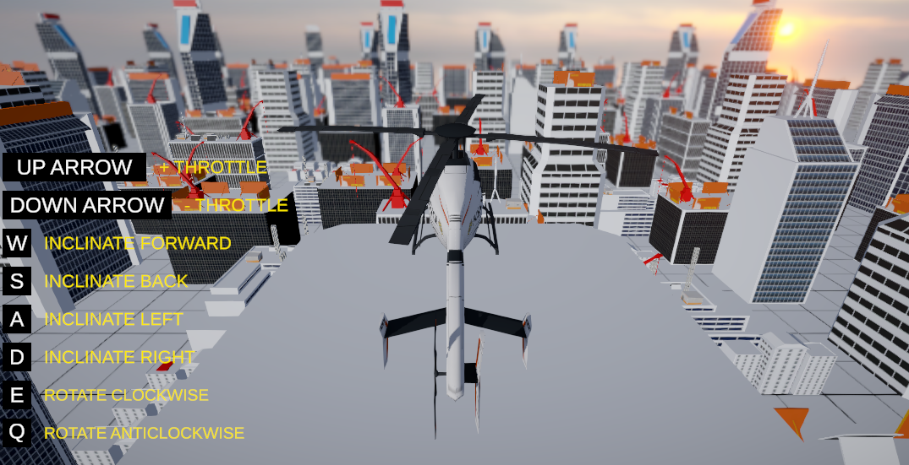

# 🚁 Gameplay - Arcade Helicopter

---

---

## 🎮 About the Project

This is a simple arcade helicopter made with Unity.

---

## 📍 Concept

Controls:

* **W/A/S/D**: Cyclic Movement (Forwared, Back, Left and Right)
* **E/Q**: Pedals Movement (Rotate Clockwise/Anticlockwise)
* **UP/DOWN ARROWS**: Throttle + Collective (Up and Down)

The idea is to keep everything modular:

* **ArcadeHelicopterSceneController**→ Entry Point
* **ArcadeHelicopterSceneController**→ Helicopter Behavior
* **ArcadeHelicopterCamera** → Main logic for Camera Control

---

> Built for learning, prototyping, and fun!
>
> If you want to learn how to create a really robust helicopter controller, take a look at **Indie-Pixel** course: https://www.indie-pixel.com/unityCourses/intro-to-unity-3d-physics---helicopters
