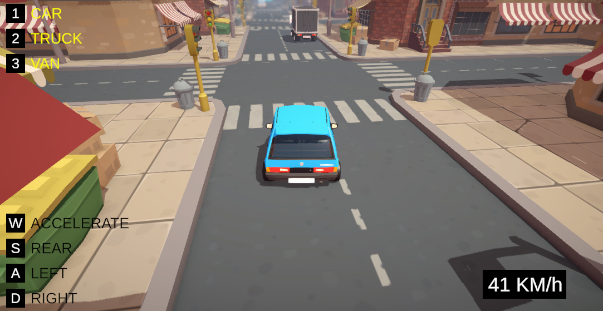

# 🚙 Gameplay - Arcade Vehicles

---

---

## 🎮 About the Project

This is a simple mini arcade vehicle made with Unity. The player can drive three differente vehicles.

---

## 📍 Concept

The player can control the vehicles with **W/A/S/D/SPACE** keys and change the vehicle using the **1,2,3** keys.

The idea is to keep everything modular:

* **ArcardeVehicleSceneController** → Entry Point
* **IArcadeVehicle** → Base for vehicles. (Check ArcadeCar, ArcadeTruck and ArcadeVan for more detailed implementations)
* **ArcadeVehicleCamera** → Main logic for Camera Control. We have 2 modes (Normal and Top)
* **ArcadeCarSpeedometer** → Simple Speed Measurement

---

> Built for learning, prototyping, and fun!
>
> Big thanks to **Arturs.Vitas** from Sketchfab for providing the assets. Check out here: https://sketchfab.com/arturs.vitas
