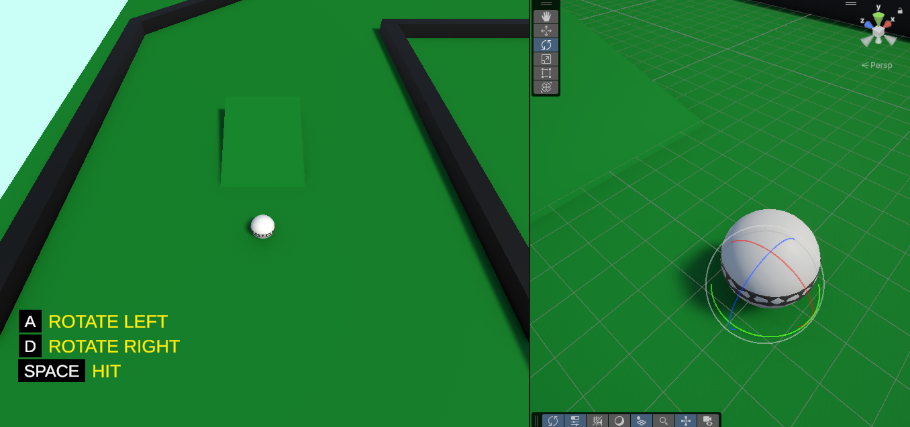

# ⛳️ Gameplay - Golf Example

---



---

## 🎮 About the Project

This is a simple mini golf prototype made with Unity. The player can aim, rotate the camera around the ball, and hit it with force.

---

## 📍 Concept

The player uses **A/D or ←/→** keys to rotate the camera.

Pressing **Space** launches the ball in the camera's current direction with a set force.

The idea is to keep everything modular:

* **Ball Controller** → Applies force to the ball
* **Camera Controller** → Follows and rotates around the ball
* **Game Controller** → Organizes general logic (input, movement, etc.)

---

## 📂 Structure

```
Assets/
├─ Scripts/
│   ├─ GolfBallController.cs
│   ├─ GolfCameraController.cs
│   └─ GolfGameController.cs
└─ Scenes/
    └─ Main.unity
```

---

> Built for learning, prototyping, and fun!
>
> Big thanks to **James Doyle** for the original tutorial inspiration!
