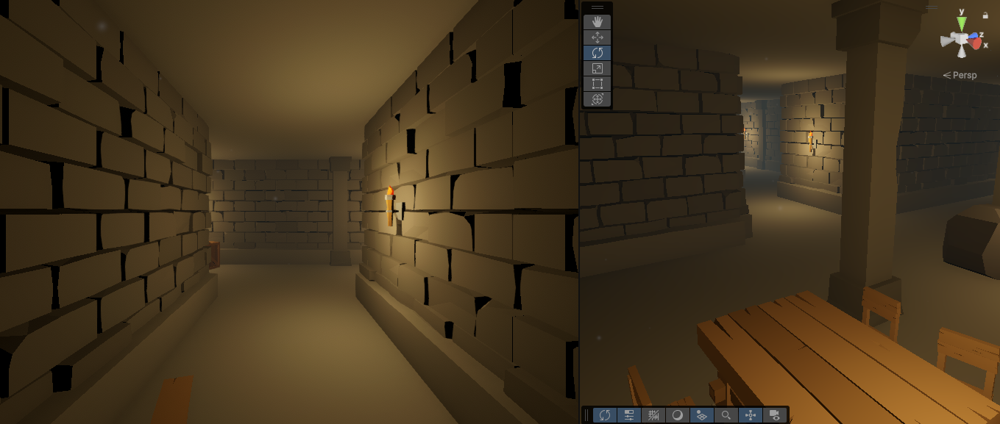

# 🧭 Gameplay - Legend of Grimrock Movement

---



---

## 🎮 About the Project

This is a simple movement prototype made with Unity, inspired by the game *Legend of Grimrock*. The player moves using keyboard input, with forward/backward movement and left/right rotation.

---

## 📍 Concept

The player uses the **W/S** keys to move forward and backward.

The **A/D** keys rotate the character left and right.

No collision or wall detection is implemented.

---

## 📂 Structure

```text
Assets/
├─ Scripts/
│   ├─ GrimrockCharacterController.cs
└─ Scenes/
    └─ Main.unity
```

---


> Built for learning, prototyping, and fun!

---

[Back to top](#🧭-gameplay---legend-of-grimrock-movement)
