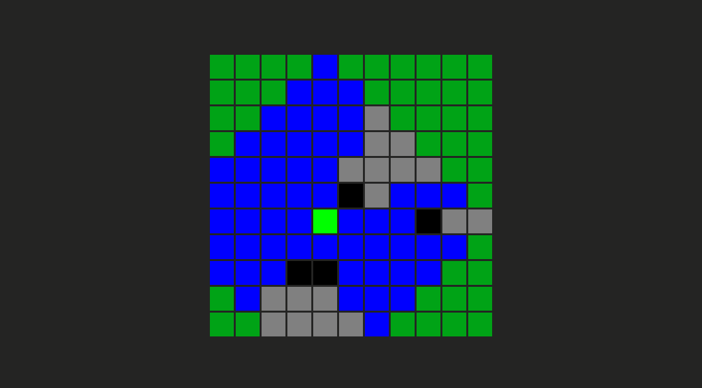

# 🧭 Gameplay - Line of Sight

---

---

## 🎮 About the Project

This is just me trying to reproduce the line of sight from a game of my childhood, Dofus. If you are interested to dive deep in this subject, check out more about Bresenham Algorithm and take a look at the following links:

https://www.albertford.com/shadowcasting/

https://www.adammil.net/blog/v125_Roguelike_Vision_Algorithms.html

https://en.wikipedia.org/wiki/Bresenham%27s_line_algorithm

---

> Built for learning, prototyping, and fun!

---

[Back to top](#🧭-gameplay---legend-of-grimrock-movement)
