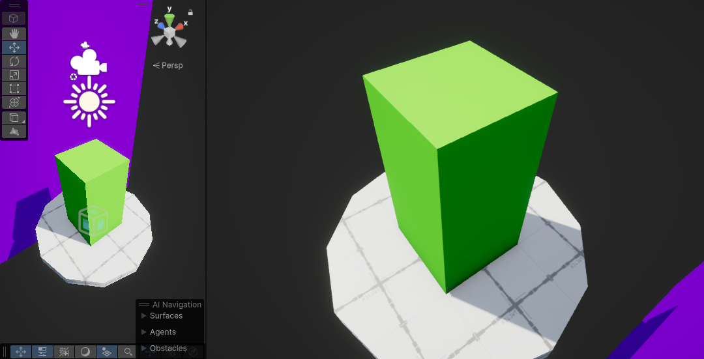

# 🌐 Gameplay - Orbital Camera

---

---

## 🎮 About the Project

This is a simple Orbital Camera Implementation.

---

## 📍 Concept

The player can control the camera position using the mouse.
Camera angles are limited to an inferior and superior angles.
The camera will handle collisions with walls.
Orbital Camera is a good base concept to know if you are into Gameplay programming.

---

> This tutorial was inspired by the amazing Catlike coding tutorials. Please check: https://catlikecoding.com/unity/tutorials/movement/orbit-camera/
> If you know Portuguese, I have a video explaining and implementing this orbital camera here: https://www.youtube.com/watch?v=2QwWNr5mc-E
> Built for learning, prototyping, and fun!