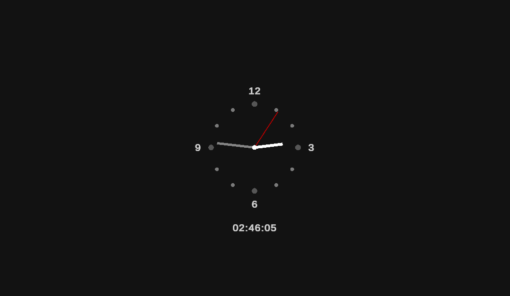

# ⏰ Gameplay - Techniques - Time of the Day

---

---

## 🎮 About the Project

This is a simple Analog and Digital Clock

---

> Built for learning, prototyping, and fun!

> Big thanks to **Tarodev(youtube)** for the sprite receiving shadows shader.
