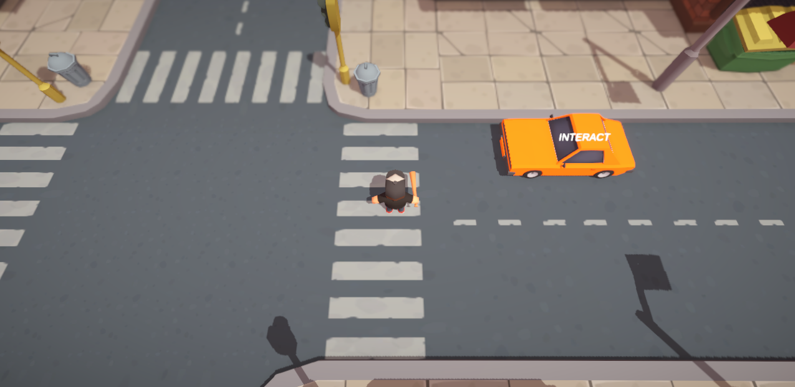

# ⛳️ Gameplay - Top Down Point and Click

---

---

## 🎮 About the Project

This is a simple top down point and click prototype made with Unity.

---

## 📍 Concept

The player click to move in the scene.

Clicking on the car (interactable) will execute the interaction.

The idea is to keep everything modular:

* **TopDownPointAndClick_GameController** → Read the Inputs and Send it to the Player Character
* **TopDownPointAndClick_CharacterController** → Move the Character
* **TopDownPointAndClick_Interactable** → Interface for any interactable in the game to implement
* **TopDownPointAndClick_Car** → Example of one simple interactable

---

> Built for learning, prototyping, and fun!
