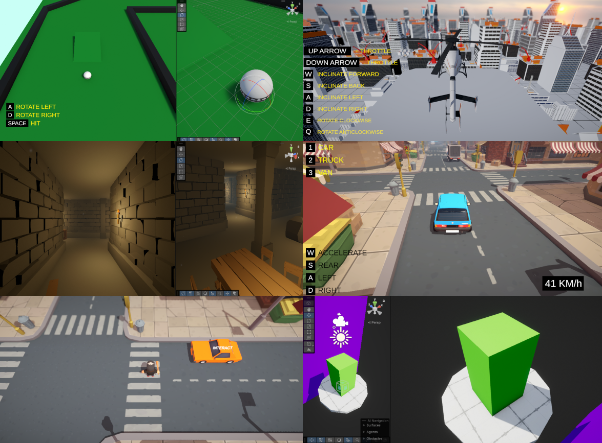
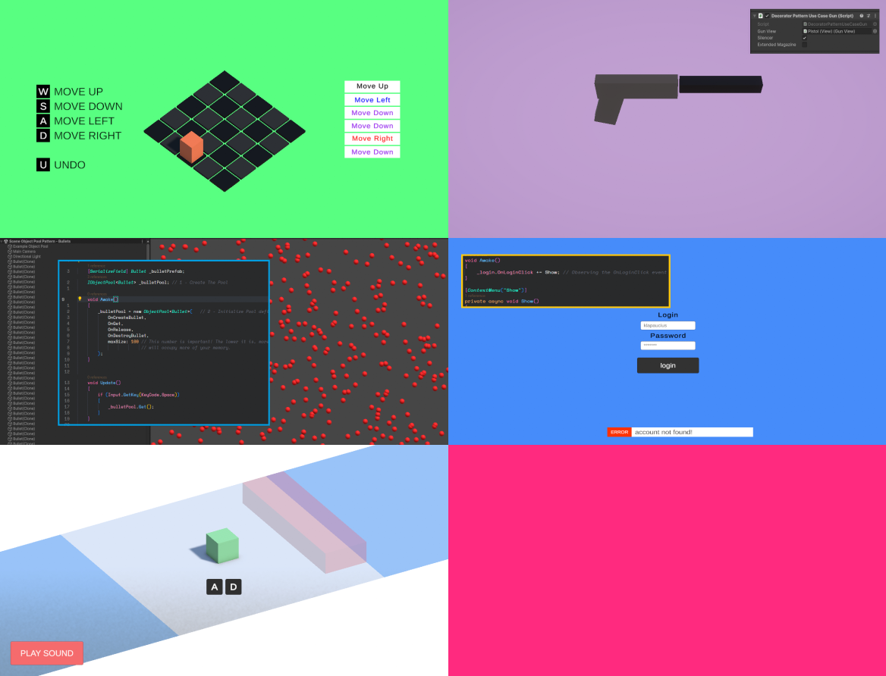

# 🎮 Unity Lab - A Friendly Source do Learn Game Programming and Unity

## 🧠 About the Project

This repository is a more organized and better-explained version of a few of the many things I enjoy learning about **game development in Unity** during my free time. It’s a compilation of practical examples of useful concepts that you can use as a reference for your own projects, or simply as a way to learn.

It’s important to note that while I’ve implemented certain design patterns and systems, **they are not necessarily final or optimal solutions for the given scenarios**. In some cases, I create scenarios just as a reason to explore and understand a concept. For example, I don’t believe the Decorator Pattern is the best approach for a weapon system, but I still see great value in having it in my toolbox for cases where it might fit.

**Are you from Godot? Unreal? Flax? Pure C++ or any other custom engine or framework?** Even if you don't use Unity, you can still translate a lot of the concepts. It wasnt much of an effort for example to implement the Orbital Camera in Flax using the exact same strategy.

This repository can be used both as a reference **toolbox** and a **study resource**. If you're unfamiliar with a concept, this may be a good place to start..

---

### 🧭 How Can I use it to Learn?

**1** - **Clone** the project in your machine

**2** - **Open the scene** with the example that you want to learn

**3** - In the scene usually there is a gameobject (or more) with a script, **open it and read the code** that you will understand my thought proccess.

4 - If you feel stuck, **a good idea is to copy the code to your prefered LLM** (GPT, Gemini, DeepSeek, etc) and use it as a **teacher**.

Feel free to **explore**, **take your time** learning, and **have fun**!

---

### 🧩 Gameplay Programming Examples

Here you'll find fun and simplified examples of **Gameplay Mechanics** that you can study and adapt for your own games. Go to [Gameplay](./Assets/Design%20Patterns/) folder.

## 🧪 Design Patterns Examples

If you're interested in learning or improving your understanding of **Design Patterns**, go to [Design Patterns](./Assets/Design%20Patterns/) folder.

